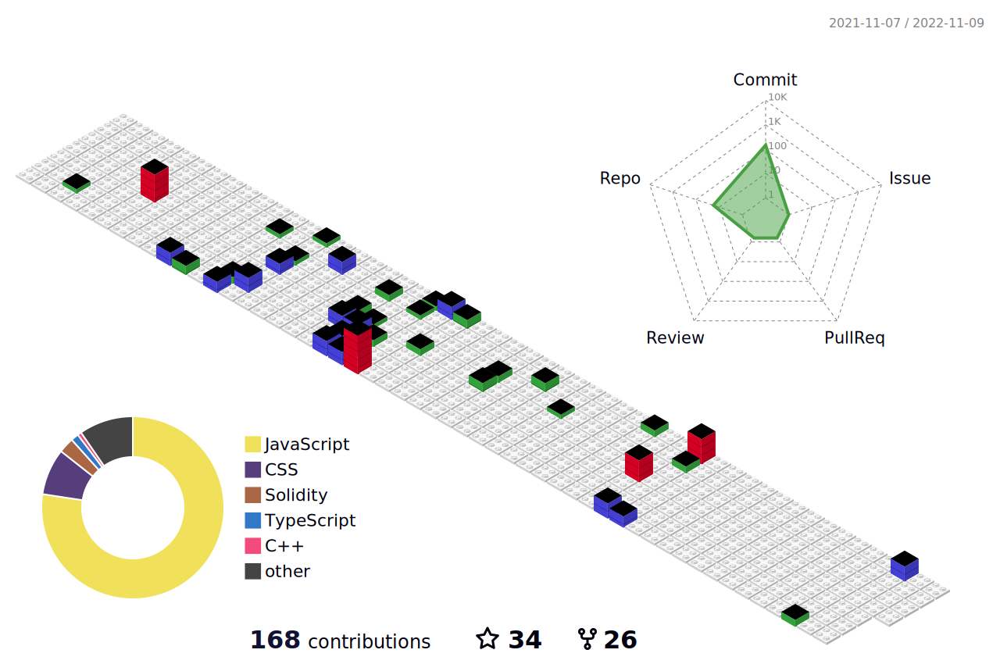

<h1 align="center">Welcome to <i>ftNikhil.eth</i>'s place</h1>

**Profile Visits**\

- 🔭 I’m currently working on **GameFI**

- 🌱 I’m currently learning **Blockchain, Web3.0**

- 👨‍💻 All of my projects are available at [https://github.com/nikhilverma360](https://github.com/nikhilverma360)

- 💬 Ask me about **Blockchain, Web3.0**

- ⚡ Fun fact : **The first programmer was the daughter of a mad poet.**

\

## 🌐 Socials:
    

# 💻 Tech Stack:
                        	    

## 🏆 GitHub Trophies

# 📊 GitHub Stats:
 
 

